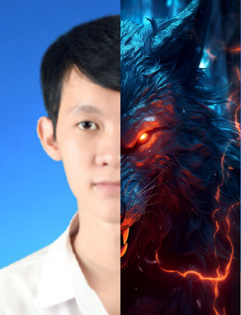

# Hi 👋, I'm Kittipoom Yuttanava

I am currently pursuing my Bachelor’s degree in Software Engineering at Burapha University. My studies focus on key areas of software development, including programming, system analysis, and software design.

---

### 📫 **Get in Touch**
- **Email**: 1102poom@gmail.com
- **GitHub**: [IamPoomMi](https://github.com/IamPoomMi) && [poommieiei](https://github.com/poommieiei)

---

### ⚙️ **Technologies and Tools**

### 📸 **Personal Snapshot**

### 🐍 GitHub Contribution

